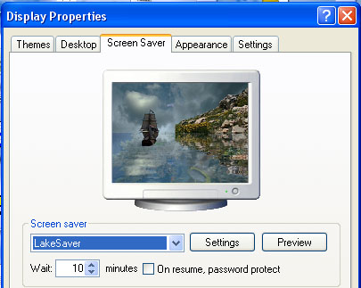



## Realtime Animated Water, Lake Screensaver

### Description

This is ready to go as screensaver like the java lake applets on the web. It has preview, settings and runs fullscreen at realtime, includes dynamic reflections of the animated sprites, moving sky and animated water. Just compile to the windows\system32 folder and its ready to go or run in the ide. Really cool looking, though when I made this about a year ago I was in a hurry with the graphics so some graphics have imperfect masking or jpeg artifacts. To configure either compile to windows and change in the normal settings of the screensaver or do it by hand in LakeScreenSaver.ini. Configure which sprites to run (bird, fish and ship and beach) whether to show the background and the level of water opacity. (Try it with no options checked and 255 opacity looks very peaceful) add some background music and you might think you're at the beach. Beach now included.

----

Update 02-12-07 Cleaned up the masking, no more rainbow colored outlines. Added a couple optimizations suggested by Roger Gilchrist. Added ships reflection to the water and made the ships movement more realistic (some). Thanks for the suggestions and support, if you have any more ideas for improvement, let me know.
 
### More Info
 

             |
---                |---
**Submitted On**   |2007-02-13 10:42:32
**By**             |[Apeiron](https://github.com/Planet-Source-Code/PSCIndex/blob/master/ByAuthor/apeiron.md)
**Level**          |Intermediate
**User Rating**    |4.7 (52 globes from 11 users)
**Compatibility**  |VB 5\.0, VB 6\.0
**Category**       |[Graphics](https://github.com/Planet-Source-Code/PSCIndex/blob/master/ByCategory/graphics__1-46.md)
**World**          |[Visual Basic](https://github.com/Planet-Source-Code/PSCIndex/blob/master/ByWorld/visual-basic.md)
**Archive File**   |[Realtime\_A2047682132007\.zip](https://github.com/Planet-Source-Code/apeiron-realtime-animated-water-lake-screensaver__1-67816/archive/master.zip)

### API Declarations

Several

